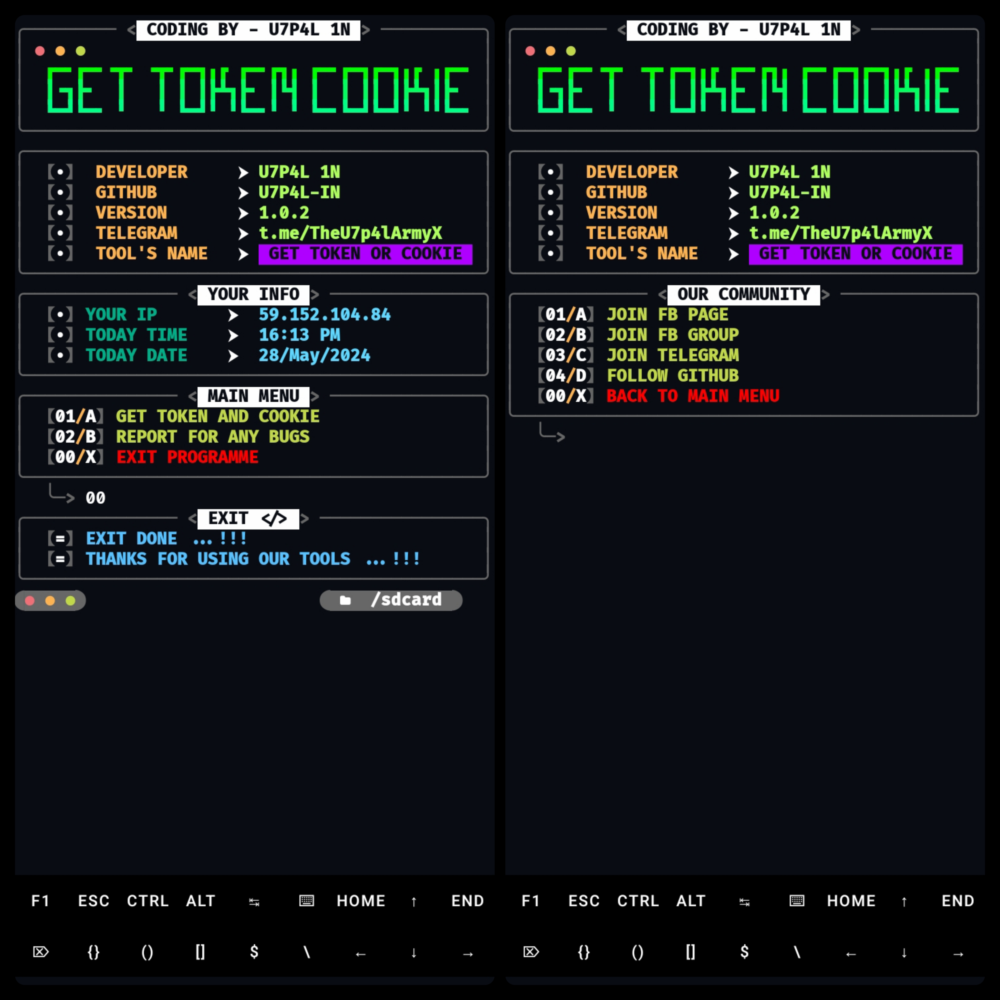
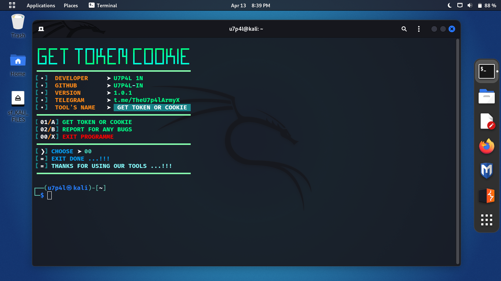
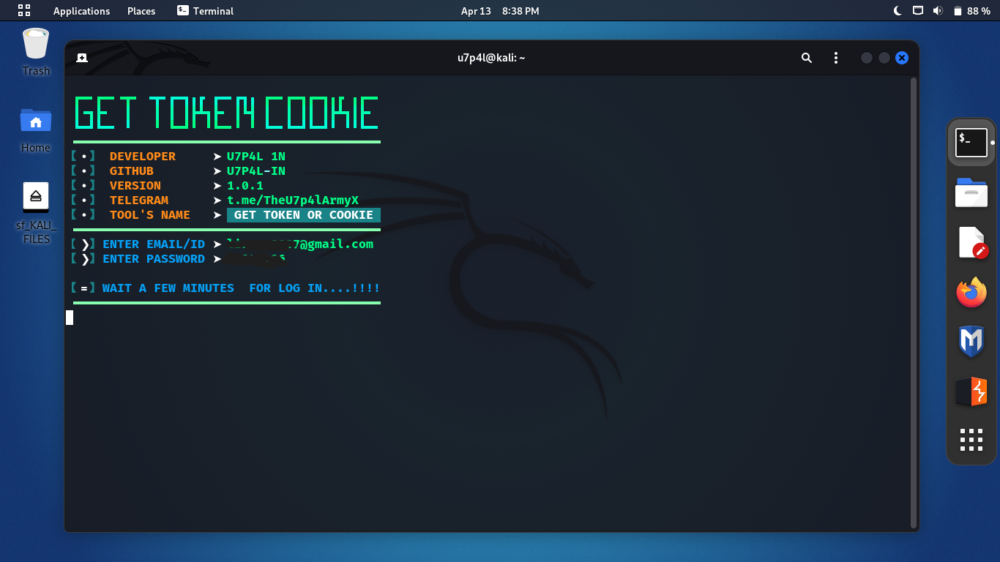
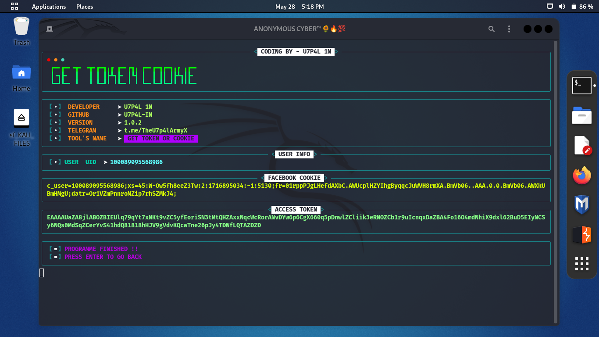

<p align="center">
</p>

</p>
   <p align="center">
      <a href="https://github.com/U7P4L-IN/TOKEN-COOKIE/stargazers">
      </a>
      <a href="https://github.com/U7P4L-IN/TOKEN-COOKIE/releases/latest">
      </a>
      <a href="https://www.conventionalcommits.org/en/v1.0.0/">
      </a>
      <a href="https://github.com/U7P4L-IN/TOKEN-COOKIE/actions/workflows/github-action.yml">
      </a>
   </p>
   
</br>

### What is TOKEN-COOKIE?
[**Tokenz**](https://github.com/U7P4L-IN/TOKEN-COOKIE) is a program to get token access from Instagram which has quite complete features.

### No tokens/cookie appearing?

- Doesn't work for cookies/token or new accounts!
- Maybe your Facebook account is checkpointed or locked.
- The Facebook system has been repaired causing failure to get tokens.

### Why login failed?

- Your Facebook account cookies are no longer valid or expired.
- Your Facebook account is logged out of the browser.
- Maybe your Facebook account has been checkpointed or temporarily locked.

## Contributing
Feel Free To Clone This Project. For Major Changes, Please Open An Issue First To Discuss What You Would Like To Change Or Add, Thank You!!.

<br>
<h4 align="left">TESTED ON > </h4><br>

* Kali Linux
* Termux
* Mac os
* Ubuntu
* Perrot Sec OS

<br>
<h4 align="left">INSTALL TOOL ON TERMUX > </h4>
 
```python
apt update && apt upgrade -y
pkg install git
pkg install python
rm -rf TOKEN-COOKIE
git clone --depth=1 https://github.com/U7P4L-IN/TOKEN-COOKIE.git
cd TOKEN-COOKIE
python main.py
```
<p align="center">

<h5 align="center"><b>TERMUX</b></h5>

<p align="center">
<p align="center";> 


# Report bugs
If you notice issues while installing this tool or running this tool kindly mail to me at <a href="mailto: AnonyminHack5@protonmail.com">Gmail</a> or Open an issue via github.

### Requirements 
```
python-3
pip
Internet Connection
And some other python packages
``` 
[Python 3](https://www.python.org/downloads/)

<hr>

<h2 align="left">Install Requirements (on Linux) > </h2><br>

```python
>> apt-get install git python3 python3-pip python python-pip
```
<h2 align="left">Kali Linux/Ubuntu/Parrot os > </h2><br>

```python
sudo apt-get update && apt-get install git
git clone https://github.com/U7P4L-IN/USER-AGENT.git
cd USER-AGENT
ls
sudo python3 main.py
```
<h5 align="center"><b>KALI LINUX</b></h5>

<p align="center">
<p align="center">
<p align="center">
    
</br>

<p align="center">  <a href="https://t.me/TheU7p4lArmyX"></a></p>

</br>

### Tools Languages :

<p align="center">

</p>

<br>
<h4 align="center">DISCLAIMER > </h4><br>

* This Tool is for Educatinal Purposes only !
* I will not br responsible for any misuse

<h2 align="center">LICENSE</h2>

Token Cookie is released under the AGPL-3.0 license, which grants the following permissions:
- Commercial use
- Modification
- Distribution
- Patent use
- Private use

For more convoluted language, see the [LICENSE](/LICENSE).
</br>

<h5 align="center"><b>DESCRIPTION</b></h5>

> [!NOTE]  
> All the tools are belongs to their copyright owner, and this use is in accordance with the terms and conditions of the copyright holder.

# Give A Star ⭐

> You can also give this repository a star to show more people and they can use this repository
